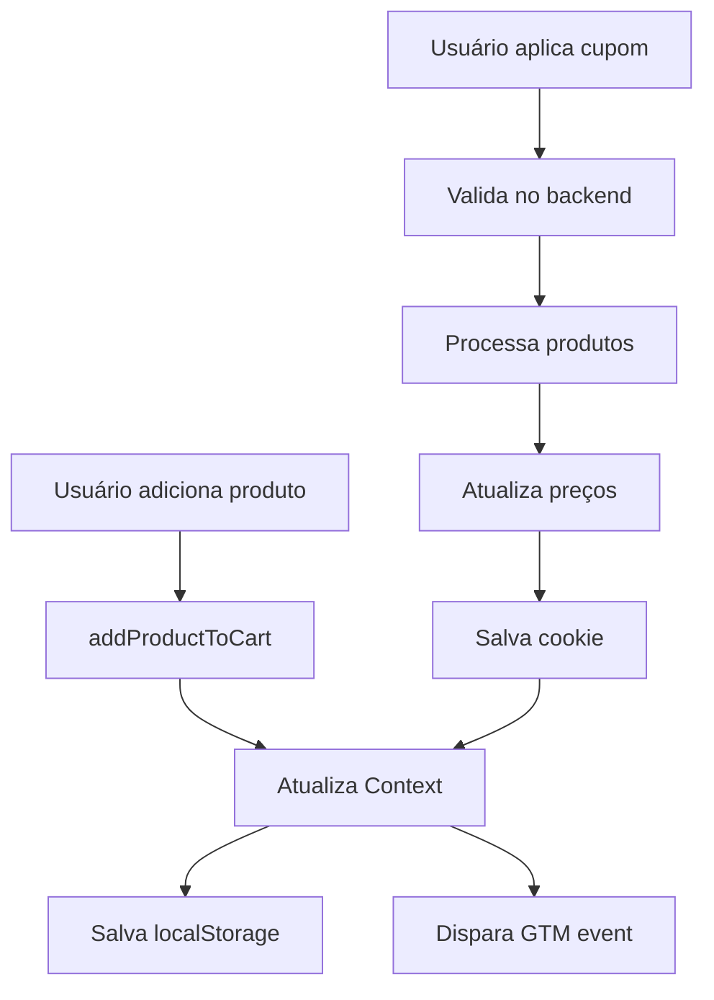

# 🛒 Sistema de Carrinho de Compras

## Arquitetura Atual

### Componentes Principais
- **Context Provider**: `/src/components/common/Context/context.jsx`
- **Modal do Carrinho**: `/src/components/cart/ModalCart/modal-cart.tsx`
- **Hook useModalCart**: `/src/hooks/useModalCart.ts`
- **Componentes UI**: CartHeader, CartProductList, CartProductItem, CartSummary

## Estado e Gerenciamento

### 1. Context API (MeuContexto)
```javascript
{
  cart: {
    "produto-id": {
      id: "1",
      nome: "Produto",
      preco: 99.90,
      preco_de: 129.90,
      quantity: 2,
      imagem: "url",
      slug: "produto-slug"
    }
  },
  total: 214.80,        // Total com frete
  cupons: [{            // Cupons aplicados
    codigo: "AJ25",
    multiplacar: 0.75
  }],
  loadingAddItem: false,
  sidebarMounted: false
}
```

### 2. LocalStorage
```javascript
localStorage.setItem('cart', JSON.stringify(cart));
localStorage.setItem('cupons', JSON.stringify(cupons));
```

### 3. Cookies (para cupons)
```javascript
document.cookie = "cupomBackend=AJ25; path=/";
```

## Funções Críticas

### Adicionar Produto
```javascript
addProductToCart(product) {
  1. Cria cópia do carrinho
  2. Adiciona ou incrementa produto
  3. Processa com cupom se existir
  4. Atualiza Context
  5. Dispara evento GTM
  6. Salva no localStorage
}
```

### Aplicar Cupom
```javascript
handleCupom(cupom) {
  1. Valida cupom no backend
  2. Aplica multiplicador aos preços
  3. Mantém backup dos preços originais
  4. Atualiza cookie cupomBackend
  5. Recalcula totais
}
```

### Calcular Total
```javascript
// Subtotal
subtotal = Σ(produto.preco * produto.quantidade)

// Com cupom
subtotal_com_desconto = subtotal * cupom.multiplicador

// Total final
total = subtotal_com_desconto + 15.00 (frete)
```

## Fluxo de Dados



## Pontos de Atenção na Refatoração

### ⚠️ Crítico - NÃO QUEBRAR:
1. **Persistência entre sessões** - localStorage deve funcionar
2. **Cálculo de cupons** - Multiplicador aplicado corretamente
3. **Sincronização** - Context, localStorage e cookies sincronizados
4. **Eventos GTM** - Todos os eventos devem disparar
5. **Backup de preços** - Campo `backup` preserva preços originais

### 🔧 Pode Melhorar:
1. Migrar context.jsx para TypeScript
2. Unificar fonte de verdade (eliminar redundâncias)
3. Mover lógica de cupom para servidor
4. Simplificar sistema de backup/restore
5. Adicionar testes unitários

## Testes Essenciais

```javascript
// Teste 1: Adicionar produto
expect(cart[productId].quantity).toBe(1);

// Teste 2: Aplicar cupom 25%
expect(product.preco).toBe(originalPrice * 0.75);

// Teste 3: Persistência
localStorage.clear();
refreshPage();
expect(cart).toEqual(savedCart);

// Teste 4: Evento GTM
expect(dataLayer.find(e => e.event === 'add_to_cart')).toBeDefined();

// Teste 5: Cálculo total
expect(total).toBe(subtotal * cupom + frete);
```

## Estrutura de Componentes

```
ModalCart/
├── modal-cart.tsx          # Container principal
├── CartHeader.tsx          # Cabeçalho com título e fechar
├── CartProductList.tsx     # Lista de produtos
├── CartProductItem.tsx     # Item individual
├── CartSummary.tsx         # Resumo e botão checkout
├── EmptyCartMessage.tsx    # Mensagem carrinho vazio
└── SuggestedProductsCarousel.tsx  # Produtos sugeridos
```

## Props e Interfaces

```typescript
interface CartProduct {
  id: string;
  nome: string;
  preco: number;
  preco_de?: number;
  quantity: number;
  imagem?: string;
  slug: string;
  backup?: {
    preco: number;
    preco_de?: number;
  };
  cupom_applied?: number;
}

interface CartContext {
  cart: Record<string, CartProduct>;
  total: number;
  cupons: Coupon[];
  addProductToCart: (product: Product) => void;
  removeProductFromCart: (product: Product) => void;
  handleCupom: (cupom: Coupon) => void;
  clearCart: () => void;
}
```

## Validações Obrigatórias

1. ✅ Quantidade mínima = 1
2. ✅ Quantidade máxima = 99
3. ✅ Preço nunca negativo
4. ✅ Frete sempre R$ 15,00
5. ✅ Apenas 1 cupom por vez
6. ✅ Carrinho vazio bloqueia checkout

## Métricas de Sucesso

- Tempo para adicionar produto < 500ms
- Taxa de erro < 0.1%
- Persistência funciona 100% das vezes
- Todos os eventos GTM disparando
- Cálculos de preço sempre corretos

---

**⚠️ IMPORTANTE**: Este componente é o CORE do e-commerce. Qualquer mudança deve ser extensivamente testada. Use os testes em `/tests/cart-and-coupon.spec.ts` para validação.