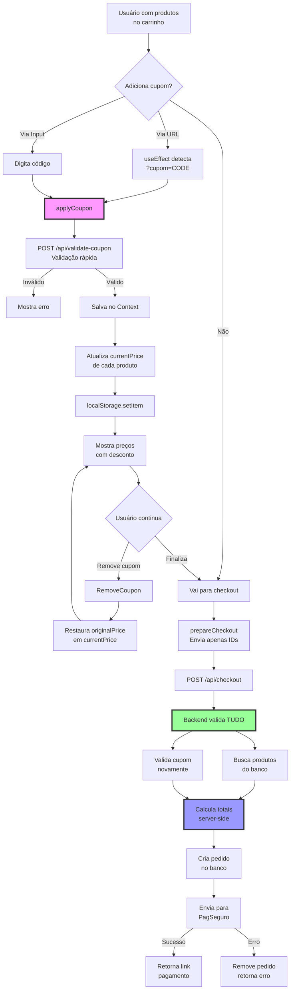

# 🔄 Fluxo Completo do Sistema Refatorado

## Visão Geral do Novo Fluxo



## 📝 Detalhes de Cada Etapa

### 1. Aplicação de Cupom (Frontend)

```typescript
// Usuário digita cupom ou vem via URL
const applyCoupon = async (code: string) => {
  // 1. Validação visual rápida
  const response = await fetch('/api/validate-coupon', {
    method: 'POST',
    body: JSON.stringify({ code })
  });
  
  const { valid, coupon } = await response.json();
  
  if (!valid) {
    showError('Cupom inválido');
    return;
  }
  
  // 2. Salva cupom no Context
  setCoupon(coupon);
  
  // 3. Atualiza preços visuais
  const updatedItems = applyDiscountToItems(items, coupon);
  setItems(updatedItems);
  
  // 4. Persiste no localStorage
  localStorage.setItem('coupon_v2', JSON.stringify(coupon));
  
  // 5. Tracking analytics
  trackEvent('apply_coupon', { code });
};
```

### 2. Estrutura de Dados Simplificada

```typescript
// Produto no carrinho
{
  id: "123",
  name: "Batom Vermelho",
  originalPrice: 50.00,    // Sempre preservado
  currentPrice: 40.00,      // Com desconto aplicado
  quantity: 2
}

// Cupom
{
  code: "DESCONTO20",
  type: "percentage",
  value: 20,              // 20% ou R$ 20
  minimumValue: 100
}

// Totais calculados
{
  subtotal: 100.00,       // Soma dos originalPrice
  discount: 20.00,        // Diferença para currentPrice
  shipping: 15.00,
  total: 95.00           // (subtotal - discount + shipping)
}
```

### 3. Checkout Seguro (Backend)

```typescript
// api/checkout/route.ts
export async function POST(req) {
  const { items, couponCode } = await req.json();
  
  // 1. NUNCA confia nos preços do cliente
  const validatedItems = await validateItems(items);
  
  // 2. Busca preços REAIS do banco
  for (const item of validatedItems) {
    const product = await db.products.findById(item.id);
    item.price = product.price; // Preço do banco
  }
  
  // 3. Valida cupom SERVER-SIDE
  let discount = 0;
  if (couponCode) {
    const coupon = await validateCouponServerSide(couponCode);
    if (coupon.valid) {
      discount = calculateDiscount(validatedItems, coupon);
    }
  }
  
  // 4. Calcula total SEGURO
  const total = calculateTotal(validatedItems, discount);
  
  // 5. Cria pedido
  const order = await createOrder({
    items: validatedItems,
    discount,
    total
  });
  
  // 6. Processa pagamento
  return processPayment(order);
}
```

## 🔐 Segurança Garantida

### Frontend (Visual)
- ✅ Preços apenas para exibição
- ✅ Desconto visual imediato
- ✅ Boa experiência do usuário

### Backend (Real)
- ✅ Preços do banco de dados
- ✅ Validação dupla do cupom
- ✅ Cálculo server-side
- ✅ Impossível manipular valores

## 📊 Comparação: Antes vs Depois

| Aspecto | Sistema Atual | Sistema Novo |
|---------|--------------|--------------|
| **Cookies** | 2 (`cupom`, `cupomBackend`) | 0 |
| **Armazenamento** | Cookies + localStorage + Context | Context + localStorage |
| **Validação cupom** | Cliente e servidor | Visual (cliente) + Real (servidor) |
| **Processamento produtos** | Múltiplas vezes | Uma vez por operação |
| **Estrutura produto** | Complexa com backup | Simples (original/current) |
| **Linhas de código** | ~400 | ~200 |
| **Arquivos** | 8 | 5 |

## 🚀 Benefícios da Refatoração

1. **Simplicidade**: Código 50% menor
2. **Segurança**: Validação server-side garantida
3. **Performance**: Menos processamento
4. **Manutenção**: Mais fácil de entender
5. **Testabilidade**: Funções puras
6. **UX mantida**: Mesma experiência visual

## ⚠️ Pontos de Atenção

### Durante a Migração
1. Testar extensivamente o cálculo de descontos
2. Garantir que localStorage migre corretamente
3. Validar que PagSeguro recebe valores corretos
4. Monitorar métricas de conversão

### Após Deploy
1. Monitorar logs de erro
2. Acompanhar taxa de abandono
3. Verificar relatórios de vendas
4. Coletar feedback dos usuários