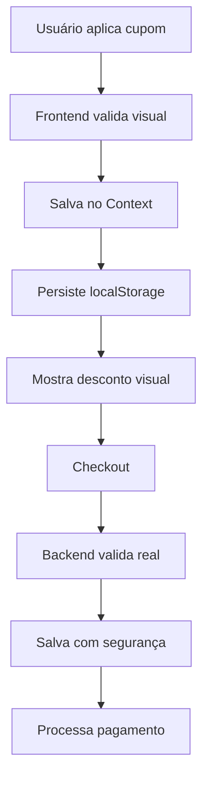

# 🚀 Proposta de Refatoração

## 🎯 Objetivos

1. **Simplificar** - Reduzir complexidade do código
2. **Manter UX** - Preços com desconto visíveis
3. **Garantir Segurança** - Validação server-side
4. **Melhorar Performance** - Menos processamento
5. **Facilitar Manutenção** - Código limpo e testável

## 🏗️ Nova Arquitetura

### Princípios Fundamentais

1. **Uma fonte de verdade**: Context + localStorage (sem cookies)
2. **Estrutura de preços clara**: `originalPrice` e `currentPrice`
3. **Validação dupla**: Visual no frontend, real no backend
4. **Sem processamento duplicado**: Cálculo único por operação
5. **Sem backup complexo**: Preço original sempre preservado

### Fluxo Simplificado



## 📁 Estrutura de Arquivos Proposta

```
src/
├── context/
│   └── CartContext.tsx         # Context unificado
├── hooks/
│   └── useCart.ts              # Hook simplificado
├── services/
│   ├── coupon.service.ts       # Validação de cupons
│   └── cart.service.ts         # Operações do carrinho
├── components/
│   └── cart/
│       ├── CartItem.tsx        # Item com preço visual
│       └── CouponInput.tsx     # Input de cupom
└── app/
    └── api/
        ├── validate-coupon/     # Nova API de validação
        └── checkout/            # API de checkout segura
```

## 🔄 Mudanças Principais

### 1. Eliminar Cookies
**Antes:**
```javascript
Cookies.set("cupomBackend", cupom);
document.cookie = "cupom=; max-age=0";
```

**Depois:**
```javascript
// Apenas Context e localStorage versionado
setCoupon(couponData);
localStorage.setItem('coupon_v2', JSON.stringify(couponData));
```

### 2. Estrutura de Produto Simplificada
**Antes:**
```javascript
{
  id: "1",
  preco: 80,
  preco_de: 100,
  backup: { preco: 100, preco_de: 120 },
  cupom_applied: 0.8
}
```

**Depois:**
```javascript
{
  id: "1",
  name: "Produto",
  originalPrice: 100,    // Sempre preservado
  currentPrice: 80,      // Com ou sem desconto
  quantity: 2
}
```

### 3. Context Unificado
**Antes:** 3 lugares (cookies, localStorage, Context)

**Depois:** 1 lugar (Context + localStorage para persistência)
```javascript
const CartContext = {
  items: Map<id, CartItem>,
  coupon: CouponData | null,
  totals: CartTotals
}
```

### 4. Validação Dupla
**Frontend (visual):**
```javascript
// Validação rápida para UX
const validateCouponVisual = async (code) => {
  const response = await fetch('/api/validate-coupon', {
    method: 'POST',
    body: JSON.stringify({ code })
  });
  return response.json(); // { valid, discount, type }
};
```

**Backend (segura):**
```javascript
// Validação real no checkout
const validateCheckout = async (items, couponCode) => {
  // Busca preços reais do banco
  const realPrices = await getRealPrices(items);
  
  // Valida cupom se existir
  const discount = couponCode 
    ? await calculateRealDiscount(realPrices, couponCode)
    : 0;
    
  return { items: realPrices, discount, total };
};
```

### 5. Remover Middleware
**Antes:** Middleware intercepta URLs

**Depois:** useEffect no Context
```javascript
useEffect(() => {
  const params = new URLSearchParams(window.location.search);
  const couponCode = params.get('cupom');
  if (couponCode) {
    applyCoupon(couponCode);
    // Remove da URL
    window.history.replaceState({}, '', window.location.pathname);
  }
}, []);
```

## 📊 Comparação de Complexidade

| Aspecto | Sistema Atual | Sistema Proposto | Redução |
|---------|--------------|------------------|---------|
| Linhas de código | ~400 | ~200 | 50% |
| Arquivos envolvidos | 8 | 5 | 37% |
| Fontes de verdade | 3 | 1 | 66% |
| Cookies | 2 | 0 | 100% |
| Processamentos | Múltiplos | Único | 80% |

## 🔐 Segurança Mantida

1. **Preços sempre do backend** no checkout final
2. **Cupom validado server-side** antes do pagamento
3. **Cliente não controla valores** finais
4. **Auditoria completa** no banco de dados

## 🎨 UX Mantida

1. **Preços riscados** quando tem desconto
2. **Aplicação instantânea** do cupom
3. **Feedback visual** imediato
4. **Persistência** entre navegações

## 📈 Benefícios

1. **Manutenção**: Código 50% menor e mais claro
2. **Performance**: Menos processamento e requisições
3. **Testabilidade**: Funções puras e isoladas
4. **Escalabilidade**: Fácil adicionar novos tipos de desconto
5. **Developer Experience**: Menos confusão e bugs

## 🚦 Riscos e Mitigações

| Risco | Mitigação |
|-------|-----------|
| Quebrar funcionalidade existente | Testes abrangentes antes de deploy |
| Usuários perderem carrinhos salvos | Notificação clara + reset automático |
| Problemas de cache | Versionamento de API |
| Resistência à mudança | Comunicação transparente sobre benefícios |

## 📋 Próximos Passos

1. Revisar e aprovar proposta de reset completo
2. Criar branch de refatoração
3. Implementar novo sistema completo
4. Testar extensivamente (limpeza + funcionalidades)
5. Deploy direto com reset automático
6. Monitorar métricas e ajustar
7. Arquivar código antigo