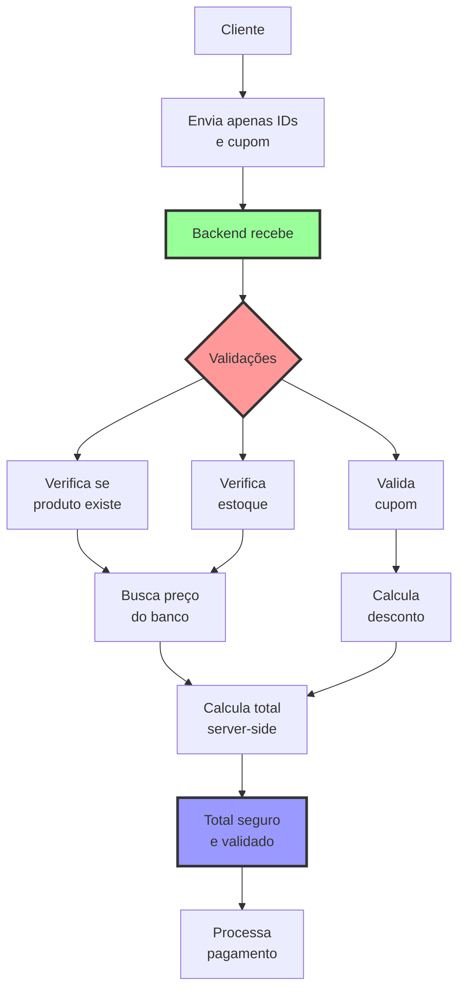

# 🔐 Considerações de Segurança

## ⚠️ Princípio Fundamental

**NUNCA confie em dados vindos do cliente para valores monetários**

## 🚨 Vulnerabilidades a Evitar

### 1. Manipulação de Preços no Cliente

**❌ INSEGURO - Cliente controla preços:**
```javascript
// Cliente envia preços
const checkout = {
  items: [{
    id: 1,
    price: 10  // Cliente pode mudar para 0.01!
  }]
}
```

**✅ SEGURO - Backend busca preços:**
```javascript
// Cliente envia apenas IDs e quantidades
const checkout = {
  items: [{ id: 1, quantity: 2 }],
  couponCode: "DESCONTO20"
}

// Backend busca preços reais
const product = await db.products.findById(1);
const realPrice = product.price; // Preço do banco de dados
```

### 2. Validação de Cupons

**❌ INSEGURO - Confia no cliente:**
```javascript
// Frontend calcula e envia desconto
const order = {
  total: 80,
  discount: 20  // Cliente pode manipular!
}
```

**✅ SEGURO - Backend valida:**
```javascript
// Backend valida cupom
export async function POST(req) {
  const { items, couponCode } = await req.json();
  
  // Valida cupom no servidor
  const coupon = await validateCouponServerSide(couponCode);
  if (!coupon.valid) {
    throw new Error("Cupom inválido");
  }
  
  // Calcula desconto no servidor
  const discount = calculateDiscount(items, coupon);
}
```

## 🛡️ Fluxo Seguro de Checkout



## 📝 Checklist de Segurança

### Frontend (Visual apenas)
- [ ] Preços são apenas para exibição
- [ ] Descontos são apenas visuais
- [ ] Não envia valores monetários para backend
- [ ] Usa HTTPS sempre
- [ ] Valida inputs do usuário

### Backend (Segurança real)
- [ ] Busca preços do banco de dados
- [ ] Valida cupons server-side
- [ ] Calcula totais server-side
- [ ] Verifica estoque antes de confirmar
- [ ] Valida limites de cupom (min/max)
- [ ] Registra todas transações
- [ ] Usa transações de banco de dados

## 🔍 Validações Necessárias no Backend

```typescript
// api/checkout/route.ts
export async function POST(req: Request) {
  const { items, couponCode, customerData } = await req.json();
  
  // 1. Validar estrutura dos dados
  if (!Array.isArray(items) || items.length === 0) {
    throw new Error("Carrinho vazio");
  }
  
  // 2. Buscar produtos reais do banco
  const validatedItems = await Promise.all(
    items.map(async (item) => {
      // Valida ID
      if (!item.id || !item.quantity) {
        throw new Error("Item inválido");
      }
      
      // Busca produto real
      const product = await prisma.product.findUnique({
        where: { id: item.id }
      });
      
      if (!product) {
        throw new Error(`Produto ${item.id} não encontrado`);
      }
      
      // Verifica estoque
      if (product.stock < item.quantity) {
        throw new Error(`Estoque insuficiente para ${product.name}`);
      }
      
      return {
        ...product,
        quantity: item.quantity,
        subtotal: product.price * item.quantity
      };
    })
  );
  
  // 3. Validar cupom se existir
  let discount = 0;
  if (couponCode) {
    const coupon = await prisma.coupon.findUnique({
      where: { code: couponCode }
    });
    
    if (!coupon) {
      throw new Error("Cupom inválido");
    }
    
    if (coupon.expiresAt < new Date()) {
      throw new Error("Cupom expirado");
    }
    
    if (coupon.usageCount >= coupon.maxUsage) {
      throw new Error("Cupom esgotado");
    }
    
    // Calcula desconto
    const subtotal = validatedItems.reduce(
      (sum, item) => sum + item.subtotal, 
      0
    );
    
    if (subtotal < coupon.minimumValue) {
      throw new Error(`Valor mínimo para cupom: R$ ${coupon.minimumValue}`);
    }
    
    discount = coupon.type === 'percentage' 
      ? subtotal * (coupon.value / 100)
      : coupon.value;
      
    // Limita desconto ao subtotal
    discount = Math.min(discount, subtotal);
  }
  
  // 4. Calcular total final
  const subtotal = validatedItems.reduce(
    (sum, item) => sum + item.subtotal, 
    0
  );
  const shipping = calculateShipping(customerData.cep);
  const total = subtotal - discount + shipping;
  
  // 5. Criar pedido em transação
  const order = await prisma.$transaction(async (tx) => {
    // Cria pedido
    const order = await tx.order.create({
      data: {
        items: validatedItems,
        couponCode,
        discount,
        shipping,
        total,
        ...customerData
      }
    });
    
    // Atualiza estoque
    for (const item of validatedItems) {
      await tx.product.update({
        where: { id: item.id },
        data: { stock: { decrement: item.quantity } }
      });
    }
    
    // Atualiza uso do cupom
    if (couponCode) {
      await tx.coupon.update({
        where: { code: couponCode },
        data: { usageCount: { increment: 1 } }
      });
    }
    
    return order;
  });
  
  // 6. Processar pagamento
  const payment = await processPayment({
    orderId: order.id,
    amount: total
  });
  
  return { order, payment };
}
```

## 🔑 Regras de Ouro

1. **Frontend**: Apenas visualização e UX
2. **Backend**: Toda lógica de negócio e segurança
3. **Banco de dados**: Fonte única de verdade para preços
4. **Transações**: Usar sempre para operações críticas
5. **Logs**: Registrar todas operações monetárias
6. **Validação**: Dupla checagem (frontend para UX, backend para segurança)

## 🚫 O que NUNCA fazer

- ❌ Aceitar preços do cliente
- ❌ Calcular descontos apenas no frontend
- ❌ Confiar em cookies para valores críticos
- ❌ Processar pagamento sem validar tudo
- ❌ Permitir que cliente modifique totais
- ❌ Usar floats para valores monetários (use integers em centavos)

## ✅ Boas Práticas

- ✅ Sempre buscar preços do banco
- ✅ Validar tudo no backend
- ✅ Usar HTTPS em produção
- ✅ Implementar rate limiting
- ✅ Logar todas transações
- ✅ Usar tokens CSRF
- ✅ Sanitizar todos inputs
- ✅ Implementar timeouts em cupons
- ✅ Verificar duplicação de pedidos