# 🔄 Fluxos de Usuário - Love Cosmetics

## 1. Fluxo de Compra Completo

### 1.1 Jornada Principal

```mermaid
graph TD
    A[Homepage] --> B[Visualizar Produto]
    B --> C[Adicionar ao Carrinho]
    C --> D[Abrir Modal Carrinho]
    D --> E{Aplicar Cupom?}
    E -->|Sim| F[Inserir Código]
    E -->|Não| G[Ir para Checkout]
    F --> H[Validar Cupom]
    H -->|Válido| I[Aplicar Desconto]
    H -->|Inválido| J[Mostrar Erro]
    I --> G
    J --> F
    G --> K[Preencher Dados]
    K --> L[Validar Formulário]
    L -->|OK| M[Criar Pedido]
    L -->|Erro| N[Mostrar Erros]
    N --> K
    M --> O[Gerar Link PagSeguro]
    O --> P[Redirecionar Pagamento]
    P --> Q[Processar Pagamento]
    Q --> R[Página Confirmação]
```


### 1.2 Detalhamento das Etapas

#### Etapa 1: Navegação e Descoberta
1. Usuário acessa homepage
2. Visualiza carousel de produtos
3. Clica em produto de interesse
4. É direcionado para PDP (página de produto)

#### Etapa 2: Adição ao Carrinho
1. Visualiza detalhes do produto
2. Clica em "Adicionar ao Carrinho"
3. Sistema adiciona produto com quantidade = 1
4. Modal do carrinho abre automaticamente
5. Evento GTM `add_to_cart` é disparado

#### Etapa 3: Gerenciamento do Carrinho
1. Usuário vê lista de produtos no carrinho
2. Pode ajustar quantidades (+/-)
3. Pode remover produtos
4. Vê total atualizado em tempo real
5. Vê produtos sugeridos no carousel

#### Etapa 4: Aplicação de Cupom (Opcional)
1. Clica em "Adicionar cupom de desconto"
2. Campo de input aparece
3. Digita código do cupom
4. Clica em "Aplicar"
5. Sistema valida no backend
6. Se válido:
   - Preços são recalculados
   - Desconto é mostrado
   - Tag de economia aparece
7. Se inválido:
   - Mensagem de erro aparece
   - Campo permanece aberto

#### Etapa 5: Checkout
1. Clica em "Finalizar Compra"
2. É direcionado para `/checkout`
3. Evento GTM `initiate_checkout` disparado
4. Formulário de checkout carrega com:
   - Dados pessoais
   - Endereço de entrega
   - Opções de consentimento

#### Etapa 6: Preenchimento de Dados
1. Preenche nome e sobrenome
2. Insere email válido
3. Digita CPF (formatação automática)
4. Insere telefone com DDD
5. Seleciona data de nascimento
6. Digita CEP
7. Sistema busca endereço automaticamente
8. Completa campos faltantes
9. Marca checkboxes opcionais

#### Etapa 7: Processamento do Pedido
1. Clica em "Ir para Pagamento"
2. Sistema valida todos os campos
3. Se válido:
   - Cria pedido no banco
   - Gera link PagSeguro
   - Evento GTM `add_payment_info`
4. Se inválido:
   - Mostra erros específicos
   - Foca no primeiro campo com erro

#### Etapa 8: Pagamento
1. É redirecionado para PagSeguro
2. Escolhe forma de pagamento
3. Insere dados de pagamento
4. Confirma pagamento
5. PagSeguro processa transação

#### Etapa 9: Confirmação
1. Retorna para `/confirmacao`
2. Vê mensagem de sucesso
3. Recebe email de confirmação
4. Evento GTM `purchase` disparado
5. Carrinho é limpo automaticamente

## 2. Fluxos Alternativos

### 2.1 Compra Rápida (Mobile)
```
1. Homepage → 2. Scroll produtos → 3. Botão "Comprar" fixo
→ 4. Adiciona e abre carrinho → 5. Checkout direto
```

### 2.2 Múltiplos Produtos
```
1. Adiciona Produto A → 2. Fecha modal → 3. Continua navegando
→ 4. Adiciona Produto B → 5. Modal mostra 2 itens → 6. Checkout
```

### 2.3 Aplicação de Múltiplos Cupons
```
Nota: Sistema atual suporta apenas 1 cupom por vez
1. Aplica Cupom A → 2. Remove Cupom A → 3. Aplica Cupom B
```

### 2.4 Abandono e Retorno
```
1. Adiciona produtos → 2. Fecha site → 3. Retorna depois
→ 4. Carrinho preservado (localStorage) → 5. Continua compra
```

## 3. Fluxos de Erro

### 3.1 Cupom Inválido
```
Input: Código inexistente ou expirado
Output: "Cupom inválido ou expirado"
Ação: Campo permanece aberto para nova tentativa
```

### 3.2 Erro de Validação no Checkout
```
Input: CPF inválido
Output: "CPF inválido"
Ação: Campo destacado em vermelho, foco automático
```

### 3.3 Falha no Pagamento
```
Input: Cartão recusado no PagSeguro
Output: Retorna ao checkout com mensagem
Ação: Pedido mantido, pode tentar novamente
```

### 3.4 Produto Sem Estoque
```
Input: Produto esgotado após adicionar
Output: "Produto indisponível"
Ação: Remove do carrinho, sugere similares
```

## 4. Fluxos Administrativos

### 4.1 Visualização de Pedidos
```
1. Login admin → 2. Acessa /pedidos → 3. Lista pedidos
→ 4. Filtra por status → 5. Vê detalhes → 6. Atualiza status
```

### 4.2 Gestão de Cupons (via Strapi)
```
1. Acessa Strapi → 2. Cupons → 3. Criar/Editar
→ 4. Define código e multiplicador → 5. Salva
```

## 5. Tracking de Eventos

### 5.1 Eventos Principais
| Ação | Evento GTM | Dados Enviados |
|------|------------|----------------|
| Adicionar produto | `add_to_cart` | product_id, name, price, qty |
| Remover produto | `remove_from_cart` | product_id, name, qty |
| Aplicar cupom | `apply_coupon` | coupon_code, discount_value |
| Remover cupom | `remove_coupon` | coupon_code |
| Iniciar checkout | `initiate_checkout` | cart_value, items |
| Add payment info | `add_payment_info` | payment_method, value |
| Compra confirmada | `purchase` | transaction_id, value, items |

### 5.2 Session Tracking
- Todos os eventos incluem:
  - `ga_session_id`: ID da sessão GA4
  - `ga_session_number`: Número da sessão
  - `event_id`: ID único do evento
  - `timestamp`: Momento do evento

## 6. Estados do Sistema

### 6.1 Estados do Carrinho
```typescript
type CartState = {
  items: Product[],
  total: number,
  subtotal: number,
  shipping: 15.00,
  discount: number,
  coupon: Coupon | null
}
```

### 6.2 Estados do Pedido
```
CREATED → PENDING → PAID → SHIPPED → DELIVERED
         ↘ CANCELLED
         ↘ FAILED
```

### 6.3 Estados do Modal
```
CLOSED → OPENING → OPEN → CLOSING → CLOSED
```

## 7. Regras de Negócio nos Fluxos

### 7.1 Carrinho
- Mínimo: 1 item para checkout
- Máximo: Sem limite de itens
- Quantidade por item: 1-99
- Frete: R$ 15,00 fixo
- Cupom: Apenas 1 por vez

### 7.2 Checkout
- Todos os campos obrigatórios
- CPF válido (validação algoritmo)
- Email válido (regex)
- Telefone: 10-11 dígitos
- CEP: 8 dígitos
- Idade mínima: 18 anos

### 7.3 Pagamento
- Métodos: Cartão, PIX, Boleto
- Parcelamento: Até 12x
- Valor mínimo: R$ 10,00
- Timeout: 30 minutos

## 8. Persistência de Dados

### 8.1 LocalStorage
```javascript
{
  "cart": {...},      // Estado completo do carrinho
  "cupons": [...],    // Cupons aplicados
  "user": {...}       // Dados do usuário (opcional)
}
```

### 8.2 Cookies
```
cupomBackend=CODIGO_CUPOM  // Para validação server-side
_ga=GA1.1.xxx              // Google Analytics
_ga_xxx=xxx                // GA4 Session
```

### 8.3 Context API
```javascript
{
  cart: {},           // Produtos no carrinho
  total: 0,          // Total com frete
  cupons: [],        // Cupons aplicados
  loading: false,    // Estado de carregamento
  modalOpen: false   // Estado do modal
}
```

## 9. Pontos de Decisão

### 9.1 Aplicar Cupom
```
SE cupom_válido E não_tem_cupom_aplicado
  ENTÃO aplica_desconto
SENÃO SE cupom_válido E tem_cupom_diferente
  ENTÃO remove_anterior E aplica_novo
SENÃO
  mostra_erro
```

### 9.2 Calcular Total
```
subtotal = SOMA(produto.preco * produto.quantidade)
desconto = subtotal * (1 - cupom.multiplicador)
total = subtotal - desconto + frete
```

### 9.3 Finalizar Compra
```
SE carrinho_vazio
  ENTÃO bloqueia_checkout
SENÃO SE formulario_invalido
  ENTÃO mostra_erros
SENÃO
  processa_pedido
```

## 10. Métricas de Sucesso dos Fluxos

### 10.1 KPIs Principais
- Taxa de conversão: > 3%
- Abandono de carrinho: < 70%
- Tempo médio checkout: < 3 min
- Taxa de erro: < 0.1%

### 10.2 Pontos de Medição
1. Homepage → Produto: CTR
2. Produto → Carrinho: Add rate
3. Carrinho → Checkout: Proceed rate
4. Checkout → Pagamento: Completion rate
5. Pagamento → Confirmação: Success rate

---

**Nota**: Todos estes fluxos devem ser testados e validados após qualquer refatoração. Use os testes E2E em `/tests/` para validação automatizada.